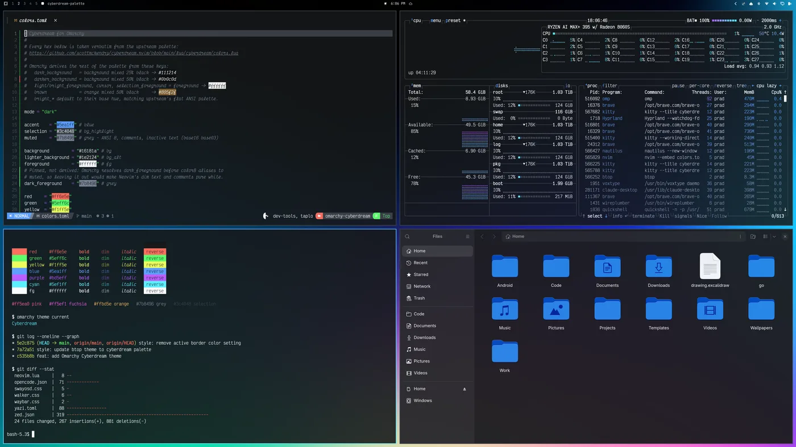
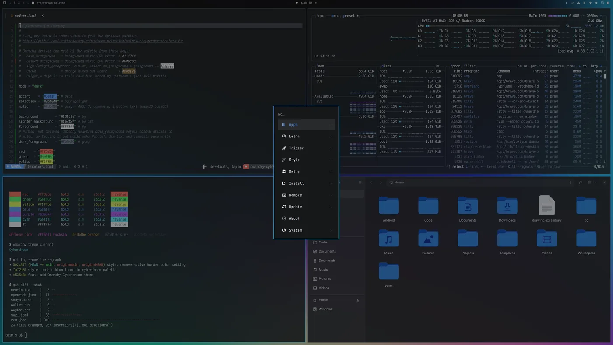
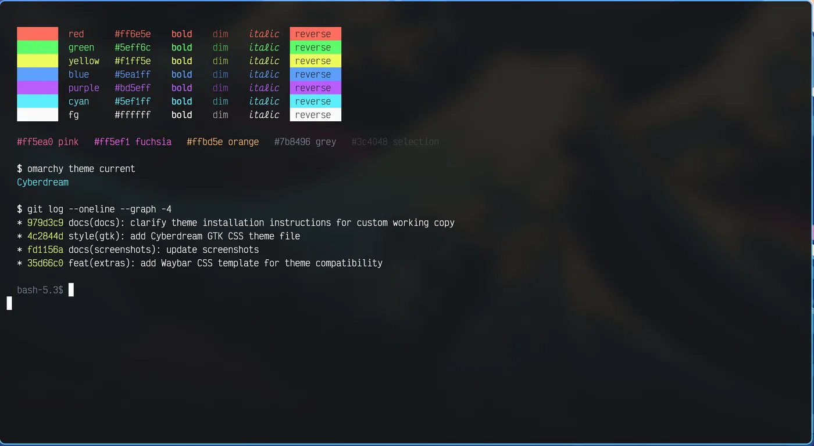

# Cyberdream for Omarchy

High-contrast neon dark theme for [Omarchy](https://omarchy.org), built on the
[cyberdream.nvim](https://github.com/scottmckendry/cyberdream.nvim) palette.



## Install

From the Omarchy menu (`Super + Space`): **Install → Style → Theme**, then paste
this repo's URL. Or from a terminal:

```bash
omarchy theme install https://github.com/prdlk/omarchy-cyberdream
```

Remove it again with **Remove → Theme**, or `omarchy theme remove cyberdream`.

Requires Omarchy 4.x (the `colors.toml` theme format).

## Screenshots

| Omarchy menu | Terminal palette |
| --- | --- |
|  |  |

## Palette

Every colour is taken verbatim from
[`lua/cyberdream/colors.lua`](https://github.com/scottmckendry/cyberdream.nvim/blob/main/lua/cyberdream/colors.lua)
(the `default` palette).

| Cyberdream | Hex | Omarchy key | Used for |
| --- | --- | --- | --- |
| `bg` | `#16181a` | `background` | terminal/bar/menu/lock background, ANSI 0 |
| `bg_alt` | `#1e2124` | `lighter_background` | cursor line, second surface |
| `bg_highlight` | `#3c4048` | `selection` | selections, meters, inactive borders |
| `grey` | `#7b8496` | `muted` | comments, inactive text, ANSI 8 |
| `fg` | `#ffffff` | `foreground` | text, cursor, ANSI 7/15 |
| `red` | `#ff6e5e` | `red` | errors, ANSI 1/9 |
| `green` | `#5eff6c` | `green` | strings, additions, ANSI 2/10 |
| `yellow` | `#f1ff5e` | `yellow` | warnings, ANSI 3/11 |
| `blue` | `#5ea1ff` | `accent`, `blue` | accent, borders, keyboard LEDs, ANSI 4/12 |
| `purple` | `#bd5eff` | `magenta` | keywords, ANSI 5/13 |
| `cyan` | `#5ef1ff` | `cyan` | border gradient end, ANSI 6/14 |
| `orange` | `#ffbd5e` | `orange` | numbers, modified state |
| `pink` | `#ff5ea0` | `pink` | extra key, templates only |
| `magenta` | `#ff5ef1` | `fuchsia` | extra key, templates only |

Omarchy has no palette slot for cyberdream's `pink` and `magenta`, so they are
exposed under the extra keys `pink` and `fuchsia` — unused by the built-in
templates, available to any `~/.config/omarchy/themed/*.tpl` you write.

Two deliberate deviations from the upstream terminal extras:

- ANSI 8 (bright black) is `grey` `#7b8496`, not `bg_highlight` `#3c4048`.
  Omarchy feeds one `muted` value to bright black *and* to comments, inactive
  text, and TUI dim text; `#3c4048` on `#16181a` is unreadable. This matches the
  upstream base16 build, where `base03` is `#7b8496`.
- Window, notification, and menu borders use a `blue → cyan` 45° gradient
  (`hyprland_active_border`), with `bg_highlight` for inactive borders.

## What this theme ships

| File | Purpose |
| --- | --- |
| `colors.toml` | The palette. Omarchy generates everything else from it. |
| `btop.theme` | Upstream cyberdream btop theme (cyan → purple graphs). |
| `helix.toml` | Upstream cyberdream Helix theme. |
| `icons.theme` | `Yaru-blue`, matching the blue accent. |
| `backgrounds/` | Five abstract gradient wallpapers (`Super + Ctrl + Space` opens the switcher). |
| `preview.png` | 1800×1012 preview for the theme switcher. |

From `colors.toml` alone, Omarchy regenerates and retints: Alacritty, Foot,
Ghostty and Kitty; Hyprland borders; the Omarchy shell (bar, menu, launcher,
notifications, OSD, polkit and lock screen); Neovim (`aether.nvim`); Chromium;
VS Code / VSCodium / Cursor; Obsidian; Claude Code; Pi; tmux; GNOME; keyboard
RGB. Nothing in this repo needs to duplicate those.

A theme installed from a git repo may not ship code, so Omarchy drops any
`*.lua`, terminal config, or `vscode.json` it finds and regenerates them from
`colors.toml`. This repo deliberately ships none of those files, so installing
it drops nothing. Neovim users who want the real thing can install
[cyberdream.nvim](https://github.com/scottmckendry/cyberdream.nvim) directly.

## Extras

Cyberdream configs for apps Omarchy does not theme. Copy the ones you want;
none of them are applied by installing the theme.

| App | File | Destination |
| --- | --- | --- |
| bat / delta syntax | `extras/cyberdream.tmTheme` | `~/.config/bat/themes/cyberdream.tmTheme`, then `bat cache --build` |
| delta | `extras/delta.gitconfig` | append to `~/.config/git/config`, then set `[delta] features = cyberdream` |
| fish | `extras/fish.theme` | `~/.config/fish/themes/cyberdream.theme`, then `fish_config theme choose cyberdream` |
| gitui | `extras/gitui.ron` | `~/.config/gitui/theme.ron` |
| k9s | `extras/k9s.yaml` | `~/.config/k9s/skins/cyberdream.yaml`, then `skin: cyberdream` in `config.yaml` |
| lazygit | `extras/lazygit.yml` | merge into `~/.config/lazygit/config.yml` |
| lsd | `extras/lsd-colors.yaml` | `~/.config/lsd/colors.yaml` |
| opencode | `extras/opencode.json` | `~/.config/opencode/themes/cyberdream.json`, then `"theme": "cyberdream"` |
| vivid (`LS_COLORS`) | `extras/vivid-cyberdream.yml` | `~/.config/vivid/themes/cyberdream.yml`, then `export LS_COLORS="$(vivid generate cyberdream)"` |
| yazi | `extras/yazi-theme.toml` | `~/.config/yazi/theme.toml` |
| zed | `extras/zed-cyberdream.json` | `~/.config/zed/themes/cyberdream.json` |

## Hacking on it

```bash
git clone https://github.com/prdlk/omarchy-cyberdream
ln -sfn "$PWD/omarchy-cyberdream" ~/.config/omarchy/themes/cyberdream
omarchy theme set cyberdream          # re-run after every edit
omarchy theme refresh                 # regenerate templates without switching
```

The generated configs land in `~/.local/state/omarchy/current/theme/` — read
them to see what a `colors.toml` change actually produced.

To refresh `preview.png` after a layout change:

```bash
grim -o <output> /tmp/shot.png
magick /tmp/shot.png -resize '1800x1012!' -strip preview.png
```

## Listing on omarchy.org

The screenshot for [the extra themes page](https://omarchy.org/themes/) is
`screenshots/omarchy-site-cyberdream.webp` (1200px wide, as their contributing
note requires). The figure block for a PR to
[omacom-io/omarchy-site](https://github.com/omacom-io/omarchy-site), in
alphabetical order between *Crimson Gold* and *Darcula*:

```html
<figure class="themes__theme">
  <a href="https://github.com/prdlk/omarchy-cyberdream"></a>
  <figcaption><a href="https://github.com/prdlk/omarchy-cyberdream">Cyberdream</a></figcaption>
</figure>
```

## Credits

- Palette: [cyberdream.nvim](https://github.com/scottmckendry/cyberdream.nvim) by Scott McKendry (MIT).
- Zed theme in `extras/`: Byt3m4st3r, from the upstream cyberdream extras.
- [Omarchy](https://omarchy.org) by Basecamp / DHH.
