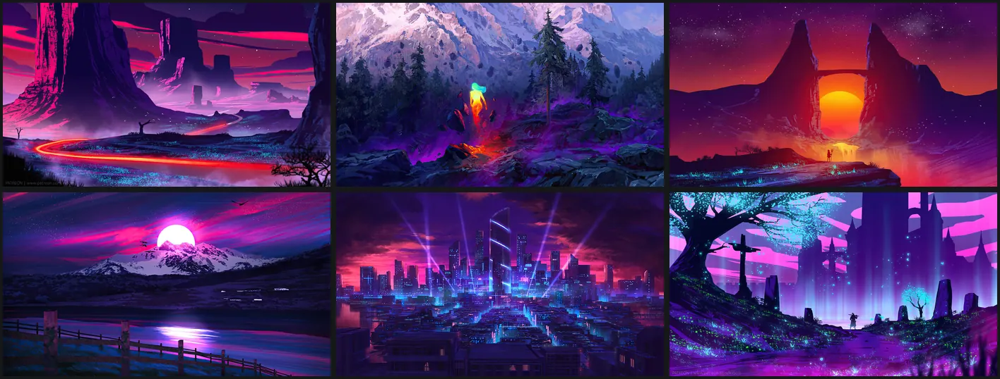

# Cyberdream for Omarchy

High-contrast neon dark theme for [Omarchy](https://omarchy.org), built on the
[cyberdream.nvim](https://github.com/scottmckendry/cyberdream.nvim) palette.


## Install

From the Omarchy menu (`Super + Space`): **Install → Style → Theme**, then paste
this repo's URL. Or from a terminal:

```bash
omarchy theme install https://github.com/prdlk/omarchy-cyberdream
```

Remove it again with **Remove → Theme**, or `omarchy theme remove cyberdream`.

Omarchy 4.x only: the palette is a `colors.toml`, and the repo ships no Lua, no
terminal config and no `vscode.json` — nothing `omarchy theme install` strips,
so a repo install and a local working copy produce the same desktop.

## Screenshots

| Omarchy menu | Terminal palette |
| --- | --- |
|  |  |

### Wallpapers

Six wallpapers in `backgrounds/`, in switcher order (`Super + Ctrl + Space`) —
fire lookout over a magenta pine forest, a neon great wave, a loaded van on a
foggy roadside, a crimson moon over a misty lake, a blossom tree shedding petals
into a sunset, and a rain-slick neon street:



## Palette

Every colour is taken verbatim from
[`lua/cyberdream/colors.lua`](https://github.com/scottmckendry/cyberdream.nvim/blob/main/lua/cyberdream/colors.lua)
(the `default` palette).

| Cyberdream | Hex | Omarchy key | Used for |
| --- | --- | --- | --- |
| `bg` | `#16181a` | `background` | terminal/bar/menu/lock background, ANSI 0 |
| `bg_alt` | `#1e2124` | `lighter_background` | cursor line, second surface |
| `bg_highlight` | `#3c4048` | `selection` | selections, meters, inactive borders |
| `grey` | `#7b8496` | `muted` | comments, inactive text, ANSI 8 |
| `fg` | `#ffffff` | `foreground` | text, cursor, ANSI 7/15 |
| `red` | `#ff6e5e` | `red` | errors, ANSI 1/9 |
| `green` | `#5eff6c` | `green` | strings, additions, ANSI 2/10 |
| `yellow` | `#f1ff5e` | `yellow` | warnings, ANSI 3/11 |
| `blue` | `#5ea1ff` | `accent`, `blue` | accent, borders, keyboard LEDs, ANSI 4/12 |
| `purple` | `#bd5eff` | `magenta` | keywords, ANSI 5/13 |
| `cyan` | `#5ef1ff` | `cyan` | border gradient end, ANSI 6/14 |
| `orange` | `#ffbd5e` | `orange` | numbers, modified state |
| `pink` | `#ff5ea0` | `pink` | extra key, templates only |
| `magenta` | `#ff5ef1` | `fuchsia` | extra key, templates only |

Omarchy has no palette slot for cyberdream's `pink` and `magenta`, so they are
exposed under the extra keys `pink` and `fuchsia` — unused by the built-in
templates, available to any `~/.config/omarchy/themed/*.tpl` you write.

Two deliberate deviations from the upstream terminal extras:

- ANSI 8 (bright black) is `grey` `#7b8496`, not `bg_highlight` `#3c4048`.
  Omarchy feeds one `muted` value to bright black *and* to comments, inactive
  text, and TUI dim text; `#3c4048` on `#16181a` is unreadable. This matches the
  upstream base16 build, where `base03` is `#7b8496`.
- Window, notification, and menu borders use a `blue → cyan` 45° gradient
  (`hyprland_active_border`), with `bg_highlight` for inactive borders.

## Look'n'feel

The theme ships no Hyprland Lua. Omarchy 4 generates `hyprland.lua` from
`colors.toml`, and the only thing this theme puts in it is the border colour:

| `colors.toml` key | Value | Result |
| --- | --- | --- |
| `hyprland_active_border` | `accent cyan 45deg` | focused window: `#5ea1ff → #5ef1ff` at 45°, also the group/tab border |
| `hyprland_inactive_border` | `selection` | everything else: `#3c4048` |

The rest of the window frame — `decoration.rounding`, blur, shadows, per-window
opacity — belongs to your look'n'feel, not to a theme. Stock Omarchy 4 is flat:
`rounding = 0`, `blur.enabled = false`, `shadow.enabled = false`, and every
window faded to `0.985 / 0.96`. The theme is built to read well there.

The shell surfaces themselves are translucent through the `shell.*.toml` files —
bar `0.62`, launcher/notifications/popups `0.78`, menu `0.80`, tooltip `0.82`.
Each file replaces one section of the `shell.toml` Omarchy generates
(`apply_shell_section_overrides` in `omarchy-theme-set-templates`), so their
colours are literal rather than templated.

### Glass is opt-in

Earlier versions shipped a `hyprland.lua` that turned blur, rounding and
shadows on — that is what the screenshots above show. It is gone:
`omarchy theme install` refuses Lua from a cloned theme, so the file only ever
worked for a local working copy, and a theme that silently reconfigures the
compositor for everyone who tries it is the wrong shape. Put it in your own
look'n'feel instead, where it survives a theme switch and you can see it:

```lua
-- ~/.config/hypr/looknfeel.lua — loaded after the theme, so it wins.
hl.config({
  decoration = {
    rounding = 8,

    blur = {
      enabled = true,
      size = 6,
      passes = 3,
      -- Near-black neon palette: dim and lift the backdrop so a 4K wallpaper
      -- never competes with the text on top of it.
      brightness = 0.75,
      contrast = 1.15,
      vibrancy = 0.25,
      noise = 0.015,
      popups = true,
      -- Chromium-family and Electron windows cannot paint a transparent
      -- background themselves, so without this a faded one shows raw
      -- wallpaper instead of blurred glass.
      ignore_opacity = true,
    },

    shadow = {
      enabled = true,
      range = 10,
      render_power = 3,
      color = "rgba(5ea1ff1a)",
      color_inactive = "rgba(0b0c0d88)",
    },
  },
})

-- Blur the Quickshell surfaces. A layer rule cannot blur unless the global
-- switch above is on; `omarchy-background` is the wallpaper, so it stays out.
hl.layer_rule({
  match = {
    namespace = "^omarchy-(bar|menu|notifications|osd|clipboard|emojis|polkit|reminders|image-selector|keyboard-panel|network-qr)$",
  },
  blur = true,
  blur_popups = true,
  ignore_alpha = 0.1,
})

-- Deepen the fade now that it reveals glass, but leave terminals alone: they
-- carry their own alpha (kitty's `background_opacity`) and the compositor
-- would multiply it.
o.window({ tag = "default-opacity" }, { opacity = "0.98 0.92" })
o.window({ tag = "terminal" }, { opacity = "1.0 1.0" })
```

Blur is not free — three passes over a 4K-class output is measurable frame time
on an iGPU. Drop `passes` to 2, or leave the block out entirely.

## What this theme ships

| File | Purpose |
| --- | --- |
| `colors.toml` | The palette. Omarchy generates everything else from it. [Flea](https://github.com/thisisgm/flea) reads it raw rather than through Omarchy's resolver, so `dark_background` is pinned there: it is Flea's sidebar, tab bar, status bar and menu plane, and the pin equals what Omarchy would derive anyway. |
| `shell.bar.toml`, `shell.menu.toml`, `shell.launcher.toml`, `shell.popups.toml`, `shell.notifications.toml`, `shell.tooltip.toml` | Translucency for the Omarchy shell surfaces; each overrides one section of the generated `shell.toml`. |
| `btop.theme` | Upstream cyberdream btop theme (cyan → purple graphs). |
| `helix.toml` | Upstream cyberdream Helix theme. |
| `icons.theme` | `Papirus-Dark` — flat, dark, and the only widely packaged set whose folders can be recoloured to the palette. Install it with `pacman -S papirus-icon-theme`; without it GTK falls back to Adwaita. `extras/papirus-cyberdream.sh` turns the folders neon. |
| `gtk.css` | GTK 3 / GTK 4 / libadwaita colours for Nautilus, file choosers and GNOME dialogs. Omarchy generates none, so without it GTK apps stay Adwaita grey. Link it once: `ln -sfn ~/.local/state/omarchy/current/theme/gtk.css ~/.config/gtk-3.0/gtk.css` (and `gtk-4.0`). |
| `backgrounds/` | Six neon wallpapers, 4K or larger except the 2560×1700 street shot (`Super + Ctrl + Space` opens the switcher). |
| `preview.png` | 1800×1012 preview for the theme switcher. |

From `colors.toml` alone, Omarchy regenerates and retints: Alacritty, Foot,
Ghostty and Kitty; Hyprland borders; the Omarchy shell (bar, menu, launcher,
notifications, OSD, polkit and lock screen); Neovim (`aether.nvim`); Chromium;
VS Code / VSCodium / Cursor; Obsidian; Claude Code; Pi; tmux; GNOME; keyboard
RGB. Nothing in this repo needs to duplicate those.

A theme installed from a git repo may not ship code, so Omarchy drops any
`*.lua`, terminal config, or `vscode.json` it finds and regenerates them from
`colors.toml`. This repo ships none of those, so nothing is dropped and the
stderr list on install stays empty. Neovim users who want the real palette can
install [cyberdream.nvim](https://github.com/scottmckendry/cyberdream.nvim)
directly.

## Extras

Cyberdream configs for apps Omarchy does not theme. Copy the ones you want;
none of them are applied by installing the theme.

| App | File | Destination |
| --- | --- | --- |
| bat / delta syntax | `extras/cyberdream.tmTheme` | `~/.config/bat/themes/cyberdream.tmTheme`, then `bat cache --build` |
| delta | `extras/delta.gitconfig` | append to `~/.config/git/config`, then set `[delta] features = cyberdream` |
| fish | `extras/fish.theme` | `~/.config/fish/themes/cyberdream.theme`, then `fish_config theme choose cyberdream` |
| gitui | `extras/gitui.ron` | `~/.config/gitui/theme.ron` |
| herdr | `extras/herdr.toml` | merge into `~/.config/herdr/config.toml`, then `herdr server reload-config`. Base theme `terminal` inherits Omarchy's ANSI palette; this pins the chrome herdr paints itself — the spaces rail, the kitty-style tab plate, agent-state marks — and turns pane borders off. |
| k9s | `extras/k9s.yaml` | `~/.config/k9s/skins/cyberdream.yaml`, then `skin: cyberdream` in `config.yaml` |
| kitty tab bar | `extras/kitty.conf.tpl` | `~/.config/omarchy/themed/kitty.conf.tpl`, then `omarchy theme refresh`. Omarchy's own kitty template sets only `active_tab_background`, leaving kitty's `#999999` grey strip and black active-tab title; this replaces the template for every theme and derives the whole tab bar from the palette. |
| lazydocker | `extras/lazydocker.yml` | merge into `~/.config/lazydocker/config.yml` |
| lazygit | `extras/lazygit.yml` | merge into `~/.config/lazygit/config.yml` |
| lsd | `extras/lsd-colors.yaml` | `~/.config/lsd/colors.yaml` |
| omp | `extras/omp.json` | `~/.omp/agent/themes/cyberdream.json`, then `omp config set theme.dark cyberdream`. Omarchy retints Pi, but omp keeps its own custom-theme dir and never reads Pi's. |
| opencode | `extras/opencode.json` | `~/.config/opencode/themes/cyberdream.json`, then `"theme": "cyberdream"` in `~/.config/opencode/tui.json` (older builds keep it in `opencode.json`) |
| Papirus folders | `extras/papirus-cyberdream.sh` | run it — it derives a `cyberdream` folder colour from Papirus's violet artwork (`#bd5eff` face, matching shades under it) and selects it with `papirus-folders`. `--color blue` and `--color cyan` give the other two palette accents. |
| vivid (`LS_COLORS`) | `extras/vivid-cyberdream.yml` | `~/.config/vivid/themes/cyberdream.yml`, then `export LS_COLORS="$(vivid generate cyberdream)"` |
| waybar | `extras/waybar.css.tpl` | `~/.config/omarchy/themed/waybar.css.tpl`, then `omarchy theme refresh`. Omarchy 4 generates no `waybar.css` (the bar is Quickshell), so a waybar config that imports one gets GTK grey; this renders the palette for every theme. Import it from `style.css` with an absolute path to `~/.local/state/omarchy/current/theme/waybar.css`. |
| yazi | `extras/yazi-theme.toml` | `~/.config/yazi/theme.toml` |
| zed | `extras/zed-cyberdream.json` | `~/.config/zed/themes/cyberdream.json` |

## Hacking on it

```bash
git clone https://github.com/prdlk/omarchy-cyberdream
ln -sfn "$PWD/omarchy-cyberdream" ~/.config/omarchy/themes/cyberdream
omarchy theme set cyberdream          # re-run after every edit
omarchy theme refresh                 # regenerate templates without switching
```

The generated configs land in `~/.local/state/omarchy/current/theme/` — read
them to see what a `colors.toml` change actually produced.

To refresh `preview.png` after a layout change:

```bash
grim -o <output> /tmp/shot.png
magick /tmp/shot.png -resize '1800x1012!' -strip preview.png
```

To rebuild `screenshots/wallpapers.webp` after changing `backgrounds/`:

```bash
rm -rf /tmp/wpthumbs && mkdir -p /tmp/wpthumbs
for f in backgrounds/*.jpg; do
  magick "$f" -resize '464x261^' -gravity center -extent 464x261 \
    -strip /tmp/wpthumbs/"$(basename "$f" .jpg)".png
done
magick montage /tmp/wpthumbs/*.png -tile 3x2 -geometry +4+4 \
  -background '#16181a' -strip -quality 80 -define webp:method=6 \
  screenshots/wallpapers.webp
```

The wallpapers are not all 16:9, so each one is cropped to fill its cell first —
`montage -geometry 464x261` alone would letterbox the odd sizes and leave the
grid ragged.

## Listing on omarchy.org

The screenshot for [the extra themes page](https://omarchy.org/themes/) is
`screenshots/omarchy-site-cyberdream.webp` (1200px wide, as their contributing
note requires). The figure block for a PR to
[omacom-io/omarchy-site](https://github.com/omacom-io/omarchy-site), in
alphabetical order between *Crimson Gold* and *Darcula*:

```html
<figure class="themes__theme">
  <a href="https://github.com/prdlk/omarchy-cyberdream"></a>
  <figcaption><a href="https://github.com/prdlk/omarchy-cyberdream">Cyberdream</a></figcaption>
</figure>
```

## Credits

- Palette: [cyberdream.nvim](https://github.com/scottmckendry/cyberdream.nvim) by Scott McKendry (MIT).
- Zed theme in `extras/`: Byt3m4st3r, from the upstream cyberdream extras.
- [Omarchy](https://omarchy.org) by Basecamp / DHH.
